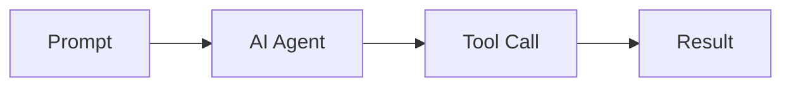

# marp-mermaid

Render Mermaid code blocks as SVG diagrams in Marp presentations.

## Installation

```sh
npm install --save-dev marp-mermaid
```

The package uses Mermaid CLI and Marp CLI, so Chromium is downloaded during
installation unless your environment provides it separately.

## Usage

Write a Mermaid code block in your Marp Markdown:

````markdown
---
marp: true
---

# AI agent workflow


````

Then build the presentation:

```sh
npx marp-mermaid slides.md --output slides.html
npx marp-mermaid slides.md --pdf --output slides.pdf
npx marp-mermaid slides.md --pptx --output slides.pptx
```

Every Mermaid block is rendered before Marp runs and embedded as an SVG data
URL. The diagram is therefore preserved in HTML, PDF, and PowerPoint output
without client-side JavaScript.

All arguments after the input file are passed to Marp CLI. Arguments before the
input file are passed to Mermaid CLI:

```sh
npx marp-mermaid --theme dark slides.md --output slides.html
```

Supported Mermaid options are `--theme`, `--backgroundColor`,
`--configFile`, `--cssFile`, `--puppeteerConfigFile`, `--scale`, `--width`,
and `--height`.

## JavaScript API

```js
import { transformMermaidBlocks } from "marp-mermaid";

const markdown = await transformMermaidBlocks(source);
```

You can provide a custom renderer, which is also useful for testing:

```js
const markdown = await transformMermaidBlocks(source, {
  render: async (diagram) => `<svg><text>${diagram}</text></svg>`,
});
```

## Requirements

- Node.js 20 or later

## License

MIT
